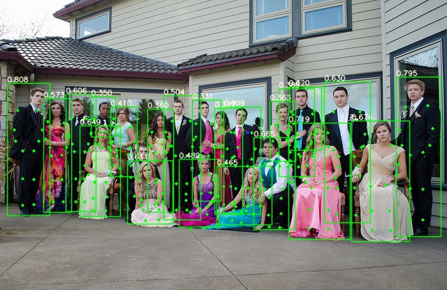

## 基于yolov5的person—pose


## Introduction

本项目基于yolov5-face模改为yolov5-peroson—pose，主要是为了完成一个端到端的行人关键点检测项目，不会因为单帧图像中多人的情况导致耗时成倍增加。
结合多任务学习的思想，引入了AutomaticWeightedLoss，得到了初步效果。由于此算法是硬相关，效果不太理想，后续会修改为软相关，后续优化还在持续中。。。，




## Data preparation
本实验基于crowdpose数据展开
1. Download crowdpose datasets.


```shell
python3 crowdpose.py

```
得到转化后的数据，本实验只提取了12个关键点


## Training

```shell
CUDA_VISIBLE_DEVICES="0,1,2,3" python3 train.py 
```


## widerface  Evaluation

```shell
python3 test_pose.py 

cd widerface_evaluate
python3 evaluation.py
```


#### Android demo

https://github.com/FeiGeChuanShu/ncnn_Android_face/tree/main/ncnn-android-yolov5_face

#### opencv dnn demo

https://github.com/hpc203/yolov5-dnn-cpp-python-v2


#### References

https://github.com/ultralytics/yolov5

https://github.com/DayBreak-u/yolo-face-with-landmark

https://github.com/xialuxi/yolov5_face_landmark

https://github.com/biubug6/Pytorch_Retinaface

https://github.com/deepinsight/insightface


#### Citation 
- If you think this work is useful for you, please cite 
 
      @article{YOLO5Face,
      title = {YOLO5Face: Why Reinventing a Face Detector},
      author = {Delong Qi and Weijun Tan and Qi Yao and Jingfeng Liu},
      booktitle = {ArXiv preprint ArXiv:2105.12931},
      year = {2021}
      }

#### Main Contributors
https://github.com/derronqi  

https://github.com/changhy666 

https://github.com/bobo0810 

